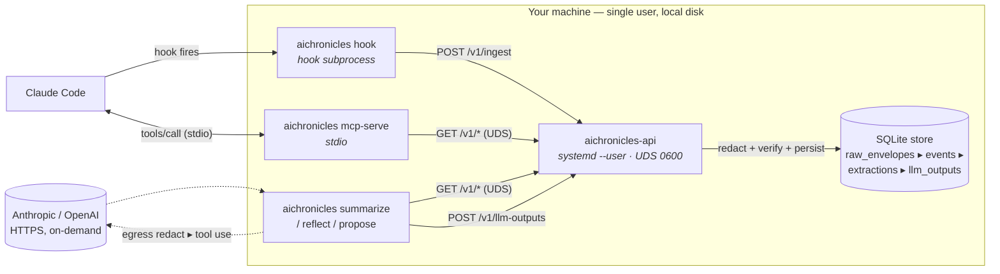

# aichronicles

**Capture your AI coding sessions, locally, with secrets scrubbed before they hit disk.**

> **Status: work in progress.**

aichronicles runs as a tiny user-mode daemon that ingests hook
events from Claude Code and Gemini CLI into a SQLite store,
exposes the corpus as an
[MCP](https://modelcontextprotocol.io) server your agent can query for
context from past work, and generates structured summaries on demand.



**Legend.** Solid arrow: data flows in this direction. Dashed arrow:
optional / on-demand (only fires for summarize/reflect/propose). The
`local` box is the trust boundary — everything inside runs as your
user, on your local disk. Cylinder is persistent state.

The diagram above is the static view (where things run). For the
*dynamic* view — what fires automatically vs. what you trigger,
and what happens step-by-step inside each flow — see
[`docs/explanation/data-flow.md`](docs/explanation/data-flow.md).

## What you get

- **Searchable corpus.** Every prompt, tool call, and response from
  your Claude Code sessions, indexed by SQLite FTS5. `aichronicles
  search 'mongodb shutdown'` returns the turn where you fixed it.
- **Structured summaries.** `aichronicles summarize --session <id>`
  produces a JSON record with topic, what-was-done, unresolved items,
  files touched, and links you actually referenced — annotated with
  what you used each one for. Cached in the store; replays for free.
- **Cross-session reflection.** `aichronicles reflect` and `propose`
  read recent sessions and surface recurring task types, friction
  sources, and concrete capabilities (skills, CLAUDE.md rules,
  scripts) worth pre-building.
- **MCP exposure.** `aichronicles mcp-serve` registers as an MCP
  server in Claude Code, so the agent can search your past sessions
  and pull a prior summary mid-conversation.
- **Edge-scrubbed.** Secrets matching ~15 patterns
  (Anthropic/OpenAI/AWS/etc.) are redacted to `<redacted:kind>`
  markers before envelopes leave the hook subprocess. The daemon
  refuses unredacted envelopes as defense-in-depth.

## Example: `aichronicles summarize`

```text
Topic: feat(grass): prefer stereo version_data over GitHub tags

What was done:
  - Added stereo.go to agents/pkg/agents/grass/ with YAML structs
    for version_data/*.yaml and a lookupStereoVersion scanner.
  - Extended grass.Analyze with a variadic opts API (WithStereoDir)
    that overrides the GitHub-tag version when stereo data matches.
  - Wired the option through the manifest-gen pipeline; added a
    --stereo-dir flag to the cg agent grass CLI command.

Unresolved:
  - cg-codeowners-check still pending — awaiting human review.
  - Reconciler config struct lacks test coverage for the new field.

Key files:
  - agents/pkg/agents/grass/stereo.go
  - bots/manifest-gen/internal/agent/analyzer/analyzer.go
  - cg/pkg/commands/agent.go

Links:
  - https://github.com/chainguard-dev/customer-issues/issues/3406
    source ticket for the harbor cert work
```

## Status

Personal-use software, single-machine. Designed for one developer
running Claude Code on their own laptop or workstation. No
multi-user authentication, no central server, no remote backup.
The threat model is documented at
[`docs/explanation/threat-model.md`](docs/explanation/threat-model.md);
read it before adopting if you handle anything sensitive.

Supports two source agents today: **Claude Code** (Anthropic) and
**Gemini CLI** (Google). Both write hooks into their respective
settings file via `aichronicles setup <agent>` and ingest live
through the same UDS daemon. The envelope schema, redaction
layer, and MCP server are agent-agnostic; adding another agent's
hook format is mostly importer work.

## Get started

[**Quick start (≤90 seconds)**](docs/tutorials/getting-started.md) —
install, bring up the daemon, see your first hook event captured.

[**Your first summary**](docs/tutorials/first-summary.md) — configure
an API key and generate a structured summary of one session.

## Documentation

| Section | What's there |
|---|---|
| [Tutorials](docs/tutorials/) | Learn by doing |
| [How-to guides](docs/how-to/) | Recipes for specific tasks |
| [Reference](docs/reference/) | CLI, configuration, schema, detectors (auto-generated) |
| [Explanation](docs/explanation/) | Architecture, data flow, threat model, design decisions |

## Building from source

```fish
git clone <repo-url> && cd aichronicles
go build ./...
go test ./...
go test -tags=integration ./integration/...
```

Targets the toolchain in `go.mod` (Go 1.26+). Five direct deps:
modernc.org/sqlite (pure-Go SQLite), spf13/cobra, BurntSushi/toml,
google/uuid, godbus/dbus/v5; plus the official Anthropic and OpenAI
SDKs.

## License

Apache-2.0 is the planned license. The `LICENSE` file lands in the
first public-release commit; until then, the code is shared under
no formal terms.

## Contributing

The development practices (commit style, testing rules, idiomatic Go
expectations) are in [`CLAUDE.md`](CLAUDE.md). Read it before opening
a PR.
