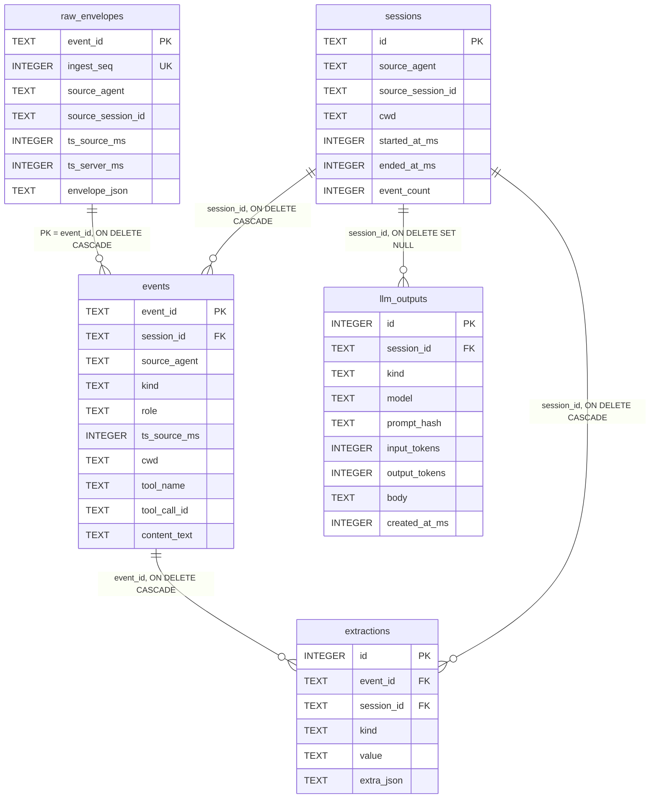

# Architecture

This page is the map you read when you're about to change code, or
when something doesn't make sense and you want to understand why
it's shaped the way it is. It complements
[data-flow.md](data-flow.md) (the dynamic view) with the static
view: what packages exist, what they depend on, what the schema
looks like, and which design decisions are load-bearing.

For the high-level system overview (the Mermaid component diagram
showing process boundaries), see the [README](../../README.md). It's
linked here intentionally — that diagram is the canonical "what are
the moving parts," and duplicating it here would just guarantee
they drift.

## Process model

aichronicles ships **two binaries plus one CLI multiplexer**, each
mapping to a distinct lifecycle:

| Binary | Process kind | Lifecycle | Owns |
|---|---|---|---|
| `aichroniclesd` | Long-running daemon | systemd `--user` unit, socket-activated | The HTTP server, the writeable handle to the SQLite store |
| `aichronicles ingest` | Short-lived subprocess | Forked per Claude Code hook event | One envelope's worth of edge redaction + one POST to the daemon |
| `aichronicles <other>` | Short-lived subprocess | Forked per user command | Read paths (`sessions`, `search`, `summaries`), import paths, summarize/reflect/propose, MCP server (`mcp-serve`) |

Why the split:

- The daemon owns the **write path** to SQLite. Centralizing writes
  in one process means we don't need cross-process coordination for
  the `ingest_seq` counter or the FTS5 trigger machinery — SQLite's
  WAL handles concurrency, but the daemon serializes the writes
  that matter.
- The ingest CLI is **fire-and-forget** by design. A wedged daemon
  can never block a Claude Code hook; the CLI exits 0 even on
  POST failures, logging structured warnings to stderr. The hook
  contract demands this.
- The other CLIs are **read-mostly**. They open the same SQLite
  file in read mode (with a few exceptions like `import-*`,
  `scrub`, `summarize`'s `llm_outputs` write). WAL mode tolerates
  concurrent readers during writes, so they don't conflict with
  the live daemon.

## Package map

```
cmd/
  aichronicles/         CLI multiplexer entrypoint
  aichroniclesd/        daemon entrypoint

internal/
  cli/                  cobra subcommands (the user-facing surface)
    summarize.go        ┐ each subcommand a small file; tests
    reflect.go          ├ alongside; llm_render.go shared by all
    propose.go          │ three for terminal vs --json output
    summaries.go        ┘
    ingest.go           the hook subprocess body
    setup.go, teardown.go         systemd + Claude Code wiring
    import_claude.go, import_jsonl.go    backfill paths
    audit.go, scrub.go            redaction inspection
    search.go, sessions.go        FTS + listing
    mcp_serve.go                  the MCP host

  daemon/               HTTP server + UDS listener
  store/                SQLite layer (one file per concern)
    migrations/         embedded *.sql, ordered by NNN_ prefix
  ingest/               on-the-wire Envelope schema; validation
    extract/            URL/file-path/shell-command pullers
  redact/               detector library + scanner combinators
  llm/                  provider-neutral interface
    config.go           Provider / Config / FromConfig switchboard
    anthropic.go        adapter using anthropic-sdk-go
    openai.go           adapter using openai-go
    prompts/            BuildSummary / BuildReflect / BuildPropose
  mcp/                  MCP JSON-RPC server + tools_aichronicles
  config/               TOML config (Notifications, Capture, LLM)
  paths/                XDG resolution (StorePath, Socket, ConfigFile)
  notify/               freedesktop notifications via dbus

api/
  openapi.yaml          authoritative spec for /v1/ingest, /v1/healthz

integration/            //go:build integration tests
```

A few non-obvious choices:

- **`internal/ingest` (the envelope) is separate from `internal/cli/
  ingest.go` (the hook subprocess body).** The first is the on-the-
  wire schema shared by every importer and the daemon; the second
  is the cobra command. They couple at the type level but live in
  different layers.
- **`internal/llm/prompts` lives under `llm/`.** It's tightly
  coupled to `llm.Tool` and `llm.Request`; promoting it to a
  sibling would create an import cycle.
- **`api/openapi.yaml` is the source of truth, not the Go types.**
  The daemon enforces field constraints via `ingest.Envelope.Validate`
  in Go, but third-party agents reading the contract should target
  the YAML. The two are kept in lockstep; the test suite has a
  parser that catches drift.

### Dependency direction

The arrow is "imports":

```
cli  ──▶  daemon, store, ingest, redact, llm, llm/prompts, mcp, config, paths, notify
daemon  ──▶  store, ingest
mcp  ──▶  store, redact
llm  ──▶  redact (egress scrub)
llm/prompts  ──▶  llm, redact, store
store  ──▶  ingest, ingest/extract
ingest  ──▶  (no internal deps)
redact  ──▶  (no internal deps)
config  ──▶  paths
paths, notify  ──▶  (no internal deps)
```

`cli` is the heaviest importer; everything that ends in user-facing
output flows through it. `redact` is at the bottom — provider-
neutral, dependency-free, used by everyone who handles user content.

The strict directionality is enforced by Go's package rules; there
are no cycles, no exceptions.

## Schema

Five tables plus one FTS5 virtual table, all in a single SQLite file
at `$XDG_STATE_HOME/aichronicles/store.db`.



Plus an FTS5 virtual table `events_fts` indexing
`events.content_text`, with `AFTER INSERT/UPDATE/DELETE` triggers
keeping it in sync. Source: `internal/store/migrations/001_initial.sql:62-78`.

### Why these five tables

- **`raw_envelopes` is sacred.** Every accepted envelope is stored
  byte-for-byte in `envelope_json` *before* any projection. If our
  schema or extraction logic ever changes, we replay from
  `raw_envelopes` rather than re-asking Claude Code for the data.
  This is the source-of-truth invariant; tests in
  `store/ingest_test.go` enforce that the stored bytes equal the
  POST body.
- **`sessions` is a derived rollup.** Created on first event for a
  session, then maintained by an `AFTER INSERT ON events` trigger
  that bumps `event_count`, `started_at_ms` (min), `ended_at_ms`
  (max), and `cwd` (last-write-wins). Listed by `aichronicles
  sessions`.
- **`events` is the queryable projection.** Typed columns extracted
  from the envelope JSON: `kind`, `role`, `tool_name`,
  `content_text`. FTS5 indexes `content_text`. This is what
  `aichronicles search` queries against.
- **`extractions` is the typed-fact layer.** URLs, file paths, and
  shell commands pulled out of envelope content at ingest time by
  `internal/ingest/extract`. Discriminated by `kind`. The Block-B
  features feed `kind='url'` rows back into prompts so the LLM
  annotates real links rather than hallucinating new ones.
- **`llm_outputs` is the LLM-output cache.** Indexed by
  `(kind, prompt_hash)` — same prompt = cache hit, no API call,
  no token charge. `session_id` is `ON DELETE SET NULL` so
  deleting a session preserves the summary as a historical record
  (just detached).

### Cascade rules, in plain language

- Delete a `raw_envelope` → its `event` cascades, which cascades to
  its `extractions`. Clean.
- Delete a `session` → all its events, extractions, AND raw
  envelopes (via the events FK back to raw) cascade. The session's
  LLM outputs get `session_id` nulled but otherwise survive.
- Delete an LLM output → standalone; nothing else cares.

The "delete a session removes everything" path matters because
`aichronicles teardown` and `aichronicles scrub` both rely on it.

## Migrations

Schema migrations are embedded SQL files under
`internal/store/migrations/NNN_description.sql`. Versioned via the
`meta` table's `schema_version` row. Each migration runs in a single
transaction; partial application is impossible. Migration runner
lives in `internal/store/migrate.go`.

Three migrations live in the tree today:
- `001_initial.sql` — the five tables + FTS5.
- `002_llm_outputs.sql` — adds the `llm_outputs` table.
- `003_sessions_effective_ts_index.sql` — expression index on
  `COALESCE(ended_at_ms, started_at_ms, 0) DESC` for the
  time-window queries in `sessions` and `summaries list`.

Adding a new migration: drop a `004_*.sql` file, bump the meta
update at the bottom (`UPDATE meta SET value='4' WHERE
key='schema_version'`), update the `TestOpen_FreshCreatesSchema`
expectation. The runner handles the rest.

## LLM provider abstraction

Two adapters — `internal/llm/anthropic.go` and `internal/llm/openai.go`
— behind one provider-neutral interface (`Client.Complete(ctx, Request)
*Response`). Both wrap official vendor SDKs:

| Concern | Anthropic adapter | OpenAI adapter |
|---|---|---|
| SDK | `github.com/anthropics/anthropic-sdk-go` | `github.com/openai/openai-go` |
| System prompt | TextBlockParam with cache_control: ephemeral | First message with `role: system` |
| Forced tool | `tool_choice={type:"tool",name:...}` | `tool_choice={type:"function",function:{name:...}}` |
| Strict schema | Inherent | `strict: true` on the function definition |
| Retries | SDK `option.WithMaxRetries` | SDK `option.WithMaxRetries` |
| Default model | `claude-sonnet-4-6` | `gpt-4o-mini` |

The adapters translate `llm.Request` ↔ SDK params on the way in,
and SDK response ↔ `llm.Response` on the way out. Tool input
schemas (raw `json.RawMessage` on our side) are mapped into typed
SDK structs. Tool-call output (typed object on Anthropic, JSON
string on OpenAI) is normalized to `json.RawMessage` so callers
unmarshal into the same `*Result` types either way.

The `prompt_hash` used for the `llm_outputs` cache is computed on
the provider-neutral `Request`, so switching providers does not
invalidate the cache for prompts that haven't actually changed.

For the why-and-how of switching providers, see
[../how-to/switch-providers.md](../how-to/switch-providers.md).

## MCP server

`aichronicles mcp-serve` is a stdio-attached JSON-RPC 2.0 server
implementing a minimal subset of the [Model Context
Protocol](https://modelcontextprotocol.io). It registers three
read-only tools:

| Tool | What it does |
|---|---|
| `search_events` | FTS5 query against `events.content_text`, deduped by (session, role, kind, content) |
| `list_sessions` | Recent sessions filtered by cwd / time window |
| `get_summary` | Latest `llm_outputs` body for a (session, kind) pair |

All three accept session-id prefixes (resolved via
`store.ResolveSessionIDPrefix`), and all three pipe their output
through `redact.Outbound` before sending it to the client — the
egress boundary applies even though the data is already scrubbed
at ingest. This is defense-in-depth: a detector added after a row
was stored still scrubs that row when read out via MCP.

We deliberately do not depend on an external MCP SDK. The
protocol surface we use is small and stable, and keeping the
serializer in our hands is what lets `redact.Outbound` run on
every byte that leaves the process. Source:
`internal/mcp/mcp.go:1-15` for the rationale.

## Trust boundaries (in code terms)

The threat model page describes trust boundaries narratively. Here's
where they're enforced in code:

- **Edge redaction (boundary 1):** `internal/cli/ingest.go:94`,
  `ingest.ApplyRedaction(&env, redact.Default())`.
- **Daemon refusal (boundary 2):** `internal/daemon/server.go:123`,
  rejects envelopes where `Redaction.Applied != true` with HTTP 400.
- **Store enforcement (boundary 3):** `internal/store/ingest.go:36-38`,
  returns `ErrRedactionRequired` even for callers that bypass the
  daemon.
- **Egress redaction (boundary 4):** prompt builders in
  `internal/llm/prompts/prompts.go` route every user-content string
  through `redact.Outbound` before composing the user message.
- **API error scrub:** `internal/llm/anthropic.go:scrubAnthropicError`
  and `internal/llm/openai.go:scrubOpenAIError`.
- **Config-file mode check:** `internal/config/config.go:LoadFrom`,
  refuses 0644-or-permissive files when any provider has
  `api_key_command` set.

## Related

- [Data flow](data-flow.md) — sequence diagrams for ingest and summarize.
- [Threat model](threat-model.md) — what this all defends and what it doesn't.
- [Redaction design](redaction-design.md) — TODO; the why behind credentials-only,
  the layering rationale, the regex choices.
