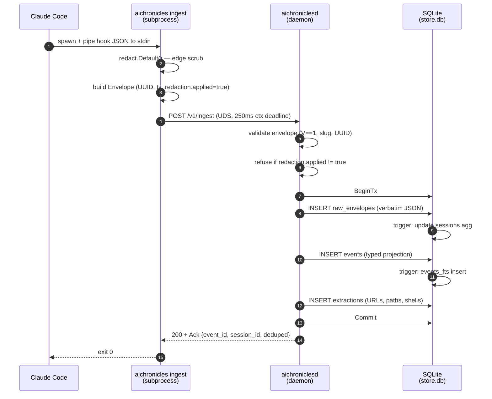
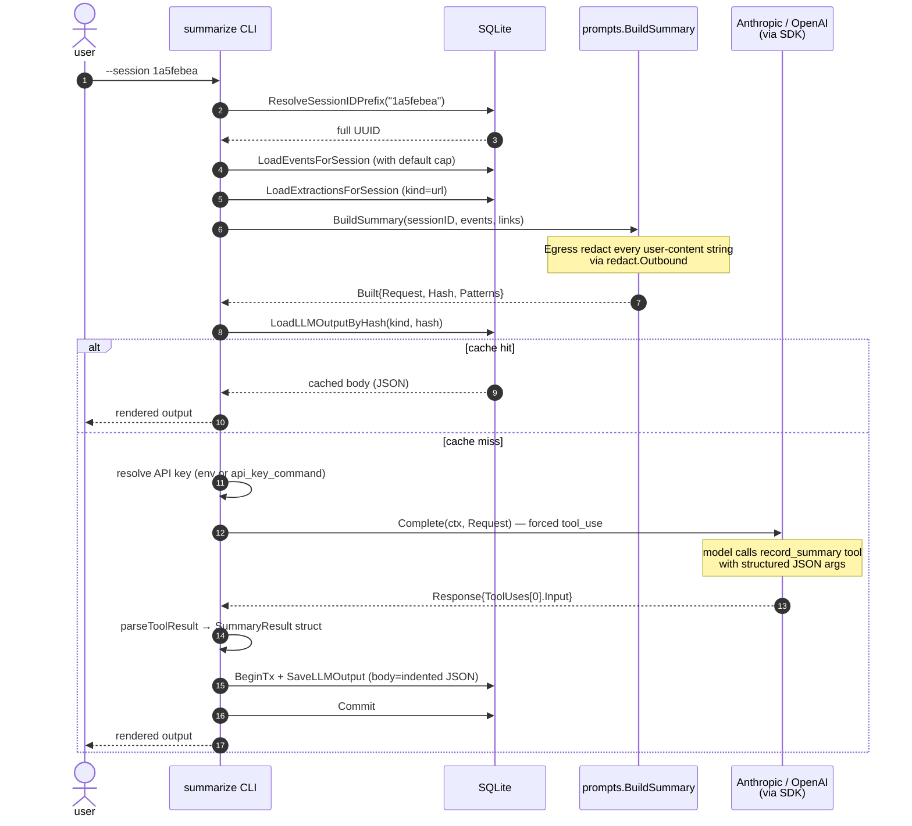

# Data flow

This page is the dynamic view: what happens, in order, when one
of two key things occurs — a Claude Code hook fires, or you run
`aichronicles summarize`. Read this when you're trying to figure
out where to add a log line, where to put a new check, or why an
outage feels the way it does.

For the static view (what packages exist, schema, dependencies),
see [architecture.md](architecture.md).

## A. Capturing one hook event

Claude Code fires a hook subprocess for each interesting event
(`UserPromptSubmit`, `PostToolUse`, etc.). The subprocess is
`aichronicles ingest`, which reads the hook payload from stdin,
edge-redacts it, wraps it in our canonical envelope, and POSTs to
the daemon over UDS.



A few non-obvious properties of this flow:

- **The 250 ms context deadline on step 4 is a hard cap on how long
  ingest can hold up the hook.** If the daemon is wedged or slow,
  the POST aborts, ingest logs a warning, exits 0, and Claude Code
  carries on. The hook never blocks the user.
- **Step 6 is defense-in-depth.** The daemon doesn't trust the
  CLI's edge-redaction claim; it explicitly verifies
  `Redaction.Applied == true` on the envelope. A forgetful or
  third-party client gets HTTP 400. The daemon does *not*
  silently re-scrub — that would mask a broken client from
  operator view.
- **Steps 8-13 run in one transaction** so a partial failure
  (e.g. an extractor bug crashing step 13) rolls back the entire
  envelope. `raw_envelopes` only ever contains rows whose
  `events`/`extractions` made it in too.
- **`raw_envelopes` is sacred** — the bytes stored at step 9 are
  the literal POST body, not a re-marshal. If the schema changes
  later, we replay from `raw_envelopes`. See
  [architecture.md#why-these-five-tables](architecture.md#why-these-five-tables).
- **Dedupe happens at the unique index level.** If `event_id`
  already exists in `raw_envelopes`, the `INSERT` is a no-op and
  we skip steps 11-13. The ack comes back with `deduped: true`.
  This makes re-runs of `import-claude-transcripts` idempotent.

### What can go wrong

| Outcome | Cause | What you see |
|---|---|---|
| HTTP 400 "Envelope validation failed" | Bad UUID, bad agent slug, missing required field | ingest warns to stderr; event lost |
| HTTP 400 "Redaction required" | `redaction.applied != true` | ingest warns; event lost |
| HTTP 413 "Envelope too large" | Body > 128 MiB | Rare; usually a runaway tool result |
| HTTP 500 "Storage error" | SQLite locked, disk full | ingest warns; daemon journal has detail |
| Connection refused | Daemon not running | ingest warns; outage notification fires once per outage |
| ctx deadline exceeded | Daemon slow | ingest warns; event lost (no retry on the hook path by design) |

The ingest CLI never returns a non-zero exit code, no matter what
goes wrong. That's load-bearing for the "never block Claude Code"
contract.

## B. Generating one summary

`aichronicles summarize --session <prefix>` is more interesting
because it has a cache hit branch and an outbound API call. Cache
hits don't need an API key.



Things worth knowing:

- **The cache check (step 8) happens before any API key is
  needed.** If the prompt hashes to an existing row, you get the
  cached body without `ANTHROPIC_API_KEY` ever being read. This
  is why `summarize --session X` works on a fresh shell with no
  env var — provided you've summarized that session before.
- **`prompt_hash` keys on the *provider-neutral* `llm.Request`.**
  Switching from Anthropic to OpenAI does not invalidate the
  cache for any prompt that's textually identical — the same
  bytes hash the same regardless of which adapter would have
  served the call. Caveat: if you change the prompt template
  itself (in `internal/llm/prompts/prompts.go`), the hash changes
  and existing rows become dead weight (harmless, but cache
  misses on first re-run).
- **The egress redactor (the note under step 6) runs at
  prompt-build time, not transport time.** Patterns that fire
  surface in `Built.Patterns`, which the CLI logs. If a user
  prompt would have leaked an API key into the LLM call, we'd
  see it in the warning before the network is even touched.
- **The forced tool_use in step 11 is what guarantees structured
  output.** The model can't return free-form prose; the SDK
  refuses anything other than a `record_summary` tool call.
  Schema validation is server-side (Anthropic's default behavior
  on tool inputs; OpenAI via `strict: true`). The result lands
  on `Response.ToolUses[0].Input` as `json.RawMessage`,
  ready to unmarshal into `prompts.SummaryResult`.
- **Step 14 stores the JSON body verbatim** — the same bytes the
  CLI just unmarshaled. Reading it back is a single
  `json.Unmarshal`; rendering for the terminal is what
  `internal/cli/llm_render.go:emitLLMBody` does.

### Reflect / propose follow the same shape

`aichronicles reflect` and `propose` use the same orchestration —
load digests, build prompt, cache check, force tool, persist,
render — but with `record_reflection` / `record_proposal` tools
and multi-session digests instead of one session's events. The
internal helper `runCachedLLM` in `internal/cli/reflect.go`
implements the shared flow.

The one structural difference: digests for reflect/propose include
per-session URL extractions (one DB query per session), so the
model can cite real links across the window. See
`digestsFromRowsWithLinks` in `reflect.go`.

## C. Reading via MCP (very short)

The MCP path is read-only and stateless. Claude Code launches
`aichronicles mcp-serve` as a subprocess, writes JSON-RPC requests
to its stdin, reads responses from stdout. The handler dispatches
to one of three tools:

```
search_events  →  SQLite FTS5 query
list_sessions  →  SELECT … FROM sessions WHERE … LIMIT ?
get_summary    →  SELECT body FROM llm_outputs WHERE …
```

All three pipe their output through `redact.Outbound` before
returning. The MCP client gets no raw bytes from the store, even
if the store somehow contains a credential the detectors caught
late.

This is why the README diagram shows the `mcp-serve` arrow as
*read-only SQL* — there is no insert path through MCP. An
adversarial MCP client can't pollute the corpus.

## What's NOT shown

- **The retry loop.** The SDKs handle 429/5xx with exponential
  backoff; we configure max retries via `option.WithMaxRetries`
  and don't see individual retries from the caller's perspective.
- **The schema migration runner.** Runs once at `store.Open`,
  before any reads or writes. See `internal/store/migrate.go`.
- **The MCP handshake.** `initialize` / `initialized` /
  `shutdown` follow the spec; `internal/mcp/mcp.go` has the
  details.
- **Daemon graceful shutdown.** `srv.Shutdown(ctx)` with a 10s
  drain budget; in-flight POSTs finish. See
  `cmd/aichroniclesd/main.go:run`.

## Related

- [Architecture](architecture.md) — the static view.
- [Threat model](threat-model.md) — where the trust boundaries
  fit into these flows.
- [Reference: cli](../reference/cli/) — every flag and arg the
  paths above accept.
