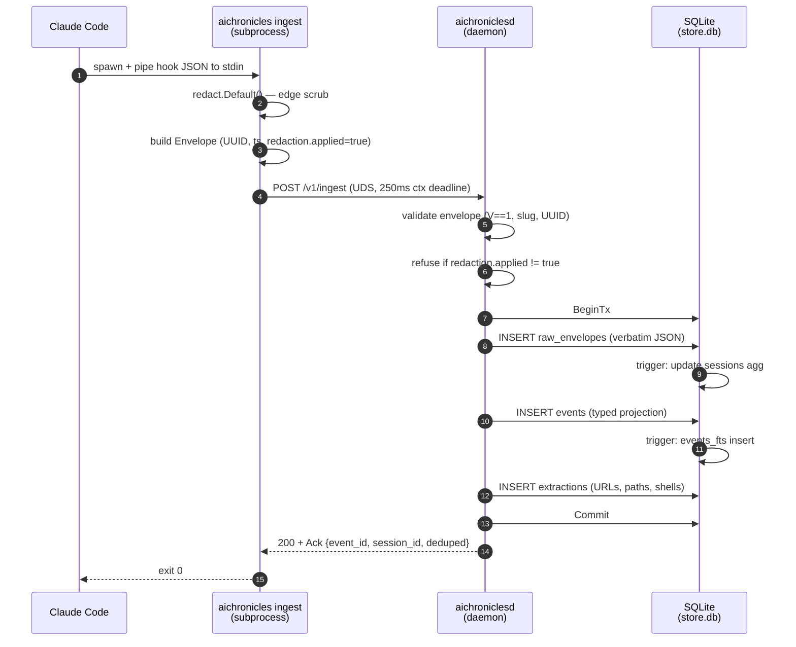
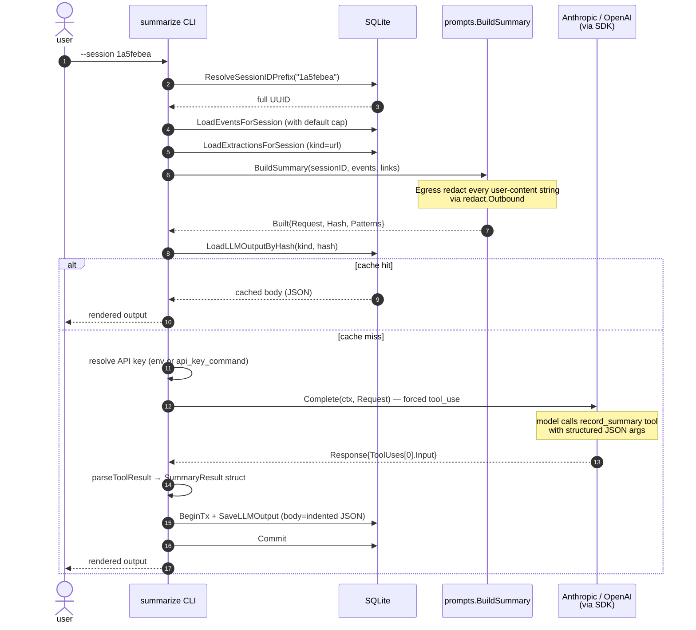
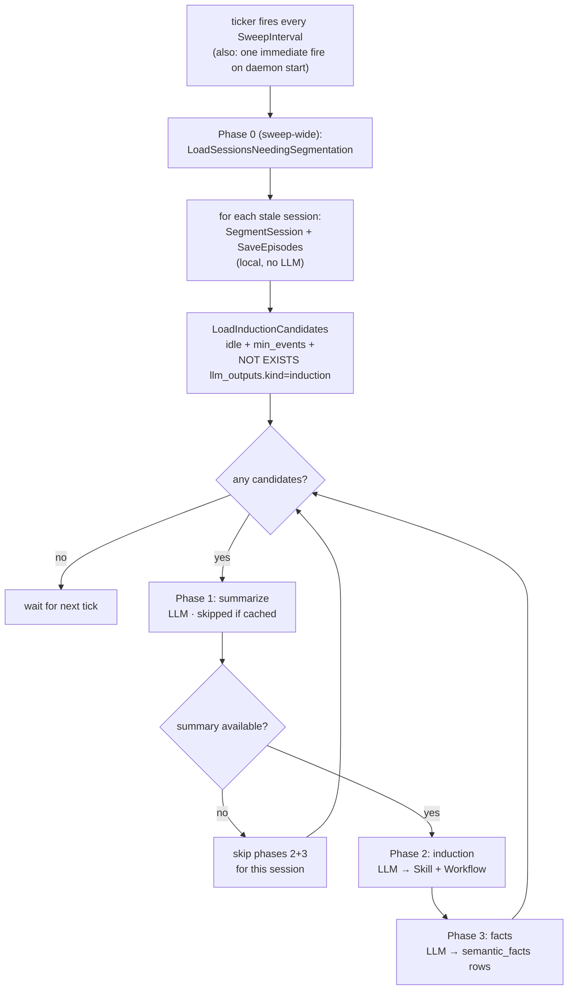
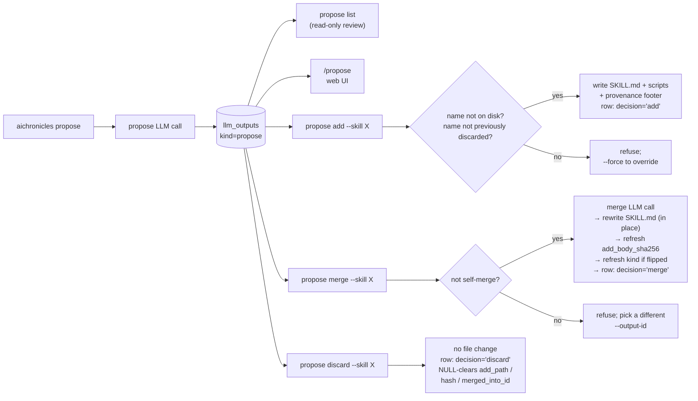
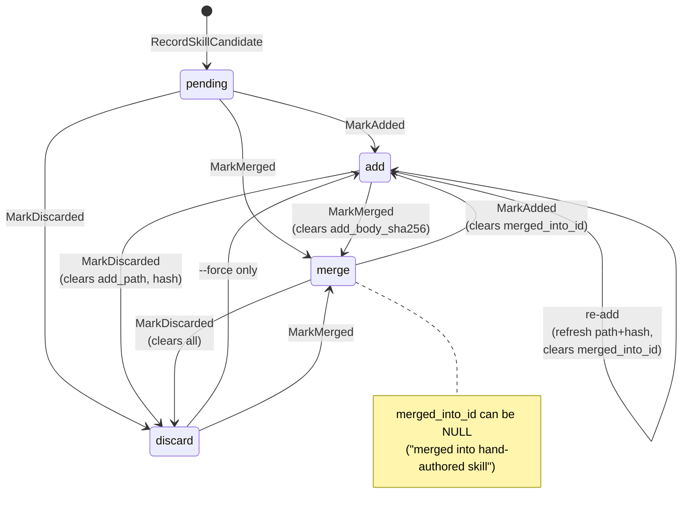

# Data flow

This page is the dynamic view: what happens, in order, when each
of the system's flows runs. Read this when you're trying to figure
out where to add a log line, where to put a new check, or why an
outage feels the way it does.

For the static view, two complementary docs:

- The trust-boundary architecture diagram on the
  [project homepage](../index.md) shows *where* components run
  (ingest subprocess, daemon, db, mcp-serve, cli, external API).
- [architecture.md](architecture.md) covers the package map, SQL
  schema (with ER diagram), migrations, and the LLM provider
  abstraction.

## What runs when (quick reference)

| Trigger                                                   | What runs                                                                                                  | Cadence                                                |
| --------------------------------------------------------- | ---------------------------------------------------------------------------------------------------------- | ------------------------------------------------------ |
| Claude Code / Gemini CLI hook fires                       | `aichronicles ingest` → daemon → `raw_envelopes` + `events` (+ FTS / extractions / sessions aggregates)    | Every event (prompt, tool call, response, …)           |
| Daemon ticker fires (when `Induction.Enabled = true`)     | One sweep: phase 0 (segment stale episodes) → 1 (summarize) → 2 (induction) → 3 (facts), per candidate     | Every `Induction.SweepInterval`                        |
| `aichronicles summarize --session <id>`                   | One summarize LLM call → `llm_outputs(kind=summary)`                                                       | Manual, on demand                                      |
| `aichronicles reflect` / `propose`                        | Multi-session digest → reflect/propose LLM call → `llm_outputs(kind=reflection / propose)`                 | Manual, on demand                                      |
| `aichronicles propose add` / `merge` / `discard --skill X` | One `skill_candidates` lifecycle transition; `add`/`merge` also write `<skills>/<name>/SKILL.md` to disk   | Manual, per skill                                      |
| `aichronicles induction sweep`                            | One-shot of the daemon's periodic work; useful when the daemon is off or you want to see per-session output | Manual, on demand                                      |
| MCP tool call from Claude Code (`search_events`, `find_episodes`, `get_summary`, …) | Read-only SQL against the store; no writes                                                                 | Per agent tool-use, while a session is active          |

The sections below detail each automatic flow (A, D) and each
manual flow (B, E), plus the read-only MCP path (C).

## A. Capturing one hook event

Claude Code fires a hook subprocess for each interesting event
(`UserPromptSubmit`, `PostToolUse`, etc.). The subprocess is
`aichronicles ingest`, which reads the hook payload from stdin,
edge-redacts it, wraps it in our canonical envelope, and POSTs to
the daemon over UDS.



A few non-obvious properties of this flow:

- **The 250 ms context deadline on step 4 is a hard cap on how long
  ingest can hold up the hook.** If the daemon is wedged or slow,
  the POST aborts, ingest logs a warning, exits 0, and Claude Code
  carries on. The hook never blocks the user.
- **Step 6 is defense-in-depth.** The daemon doesn't trust the
  CLI's edge-redaction claim; it explicitly verifies
  `Redaction.Applied == true` on the envelope. A forgetful or
  third-party client gets HTTP 400. The daemon does *not*
  silently re-scrub — that would mask a broken client from
  operator view.
- **Steps 8-13 run in one transaction** so a partial failure
  (e.g. an extractor bug crashing step 13) rolls back the entire
  envelope. `raw_envelopes` only ever contains rows whose
  `events`/`extractions` made it in too.
- **`raw_envelopes` is sacred** — the bytes stored at step 9 are
  the literal POST body, not a re-marshal. If the schema changes
  later, we replay from `raw_envelopes`. See
  [architecture.md#why-these-five-tables](architecture.md#why-these-five-tables).
- **Dedupe happens at the unique index level.** If `event_id`
  already exists in `raw_envelopes`, the `INSERT` is a no-op and
  we skip steps 11-13. The ack comes back with `deduped: true`.
  This makes re-runs of `import-claude` idempotent.

### What can go wrong

| Outcome | Cause | What you see |
|---|---|---|
| HTTP 400 "Envelope validation failed" | Bad UUID, bad agent slug, missing required field | ingest warns to stderr; event lost |
| HTTP 400 "Redaction required" | `redaction.applied != true` | ingest warns; event lost |
| HTTP 413 "Envelope too large" | Body > 128 MiB | Rare; usually a runaway tool result |
| HTTP 500 "Storage error" | SQLite locked, disk full | ingest warns; daemon journal has detail |
| Connection refused | Daemon not running | ingest warns; outage notification fires once per outage |
| ctx deadline exceeded | Daemon slow | ingest warns; event lost (no retry on the hook path by design) |

The ingest CLI never returns a non-zero exit code, no matter what
goes wrong. That's load-bearing for the "never block Claude Code"
contract.

## B. Generating one summary

`aichronicles summarize --session <prefix>` is more interesting
because it has a cache hit branch and an outbound API call. Cache
hits don't need an API key.



Things worth knowing:

- **The cache check (step 8) happens before any API key is
  needed.** If the prompt hashes to an existing row, you get the
  cached body without `ANTHROPIC_API_KEY` ever being read. This
  is why `summarize --session X` works on a fresh shell with no
  env var — provided you've summarized that session before.
- **`prompt_hash` keys on the *provider-neutral* `llm.Request`.**
  Switching from Anthropic to OpenAI does not invalidate the
  cache for any prompt that's textually identical — the same
  bytes hash the same regardless of which adapter would have
  served the call. Caveat: if you change the prompt template
  itself (in `internal/llm/prompts/prompts.go`), the hash changes
  and existing rows become dead weight (harmless, but cache
  misses on first re-run).
- **The egress redactor (the note under step 6) runs at
  prompt-build time, not transport time.** Patterns that fire
  surface in `Built.Patterns`, which the CLI logs. If a user
  prompt would have leaked an API key into the LLM call, we'd
  see it in the warning before the network is even touched.
- **The forced tool_use in step 11 is what guarantees structured
  output.** The model can't return free-form prose; the SDK
  refuses anything other than a `record_summary` tool call.
  Schema validation is server-side (Anthropic's default behavior
  on tool inputs; OpenAI via `strict: true`). The result lands
  on `Response.ToolUses[0].Input` as `json.RawMessage`,
  ready to unmarshal into `prompts.SummaryResult`.
- **Step 14 stores the JSON body verbatim** — the same bytes the
  CLI just unmarshaled. Reading it back is a single
  `json.Unmarshal`; rendering for the terminal is what
  `internal/cli/llm_render.go:emitLLMBody` does.

### Reflect / propose follow the same shape

`aichronicles reflect` and `propose` use the same orchestration —
load digests, build prompt, cache check, force tool, persist,
render — but with `record_reflection` / `record_proposal` tools
and multi-session digests instead of one session's events. The
internal helper `runCachedLLM` in `internal/cli/reflect.go`
implements the shared flow.

The one structural difference: digests for reflect/propose include
per-session URL extractions (one DB query per session), so the
model can cite real links across the window. See
`digestsFromRowsWithLinks` in `reflect.go`.

## C. Reading via MCP (very short)

The MCP path is read-only and stateless. Claude Code launches
`aichronicles mcp-serve` as a subprocess, writes JSON-RPC requests
to its stdin, reads responses from stdout. The handler dispatches
to one of three tools:

```
search_events  →  SQLite FTS5 query
list_sessions  →  SELECT … FROM sessions WHERE … LIMIT ?
get_summary    →  SELECT body FROM llm_outputs WHERE …
```

All three return rows from the store verbatim. Ingest is the
single point of redaction truth — every envelope was scrubbed at
the edge and the daemon refused anything that wasn't, so what
the MCP client sees is what was already safe to store. When the
detector set changes, `aichronicles scrub` rewrites old rows in
place; the MCP path then surfaces the rewritten content
unchanged.

This is why the README diagram shows the `mcp-serve` arrow as
*read-only SQL* — there is no insert path through MCP. An
adversarial MCP client can't pollute the corpus.

## D. The induction sweep (automatic, when enabled)

Section A handles capture; this is the automatic *processing* layer.
A daemon-resident goroutine
(`internal/daemon/induction.go:InductionSweeper`) fires the sweep
on every `Induction.SweepInterval` tick — plus once immediately on
daemon start so a backlog after downtime drains without waiting a
full interval. Disabled by default; opt in via config
(`Induction.Enabled = true` in the daemon config TOML).



A few non-obvious properties:

- **Phase 0 is sweep-wide, not per-candidate.** It runs over every
  session whose `episodes` table lags behind its `events` table —
  either no episodes at all, or `MAX(episodes.ended_at_ms) <` the
  newest event. Pre-fix it lived inside the per-candidate loop,
  which meant once a session had an `llm_outputs.kind=induction`
  row it permanently dropped out — and any late events arriving
  afterwards were never segmented. See
  `internal/store/episodes.go:LoadSessionsNeedingSegmentation`.
- **Each phase has its own per-call timeout** derived from the
  parent `ctx`. Without that, a single slow LLM call would burn
  the whole sweep's deadline budget and starve every later
  session — the bug session 9ec75b11's facts phase originally
  tripped (see `internal/cli/induction.go:RunInductionSweep`).
- **Phase 1 failure skips phases 2+3 for *that session only*.**
  Induction and facts both gate on a summary being present;
  they'd just log "no summary" errors of their own, so we
  short-circuit. The next tick retries.
- **One panic per tick is recovered.** The `tick()` method has a
  `defer recover()` so a malformed prompt or LLM hiccup doesn't
  strand the goroutine. The next tick fires regardless.
- **Manual one-shot:** `aichronicles induction sweep` runs the
  same `RunInductionSweep` function with `io.Stdout` for
  rendering — useful when the daemon is off or you want to see
  the per-session output.

## E. The propose lifecycle (manual)

`aichronicles propose` is the suggestion-generating cousin of
summarize. Same `runCachedLLM` orchestration, but the digest
spans many recent sessions and the model emits `record_proposal`
with up to 5 skill candidates. Per-candidate, the user then picks
one of three maintenance actions (AutoSkill vocabulary: `add` /
`merge` / `discard`).



Each decision flips the `skill_candidates` row keyed by
`(llm_output_id, skill_name)` — the row was inserted at extract
time and starts in `pending`. The state machine:



Non-obvious properties:

- **The state machine is per-row, but two guards are cross-row.**
  `propose add --skill X` consults *every* `skill_candidates`
  row with `skill_name=X` and refuses if any has
  `decision='discard'` (unless `--force`) — the discard signal
  was being undermined by next-output re-adds otherwise. The
  on-disk dedup check is the other cross-row guard.
- **Self-merge is refused before the LLM call.** If the user
  ran `propose add` on this output and is now running
  `propose merge` against the same `(output_id, skill_name)`,
  `LoadAddedSkillCandidate` (which filters by skill_name only)
  would return that very row — the schema's `merged_into_id
  REFERENCES skill_candidates(id)` doesn't reject self-FKs, so
  without the guard the row would point at itself. The
  fast-path refusal lives in
  `internal/cli/propose_merge.go:mergeProposedSkill`.
- **Every transition NULL-clears fields that don't apply.**
  Pre-fix, `add → discard` kept `add_path` populated (a
  "rejected" row still claiming to own a SKILL.md);
  `merge → add` kept `merged_into_id` stale; `add → merge`
  kept the prior body hash. Each `Mark*` helper now writes
  the right NULLs in its UPDATE list.
- **After merge, both the source row AND the target row get
  updated.** The source (`(outputID, skillName)`) flips to
  `decision='merge'`. The target (`existingCandidate.ID` from
  `LoadAddedSkillCandidate`) keeps `decision='add'` but its
  `add_body_sha256` is refreshed via
  `UpdateSkillCandidateAddBodyHash` and its `kind` via
  `UpdateSkillCandidateKind` (so a `pattern` skill that
  absorbed a `pitfall` candidate ends up labelled `pitfall`).
  Without these refreshes the next `skills verify` would flag
  every merged skill as drifted.
- **Hand-authored merges use `merged_into_id = NULL`.** When
  the user runs `propose merge` against a SKILL.md that
  predates aichronicles (no candidate row owns it),
  `MarkSkillCandidateMerged` accepts a sentinel `0` →
  writes NULL. Without this, the candidate stayed `pending`
  and future propose runs misread that as "user ignored",
  biasing away from a useful suggestion.

## What's NOT shown

- **The retry loop.** The SDKs handle 429/5xx with exponential
  backoff; we configure max retries via `option.WithMaxRetries`
  and don't see individual retries from the caller's perspective.
- **The schema migration runner.** Runs once at `store.Open`,
  before any reads or writes. See `internal/store/migrate.go`.
- **The MCP handshake.** `initialize` / `initialized` /
  `shutdown` follow the spec; `internal/mcp/mcp.go` has the
  details.
- **Daemon graceful shutdown.** `srv.Shutdown(ctx)` with a 10s
  drain budget; in-flight POSTs finish. See
  `cmd/aichroniclesd/main.go:run`.

## Related

- [Architecture](architecture.md) — the static view.
- [Threat model](threat-model.md) — where the trust boundaries
  fit into these flows.
- [Reference: cli](../reference/cli/) — every flag and arg the
  paths above accept.
